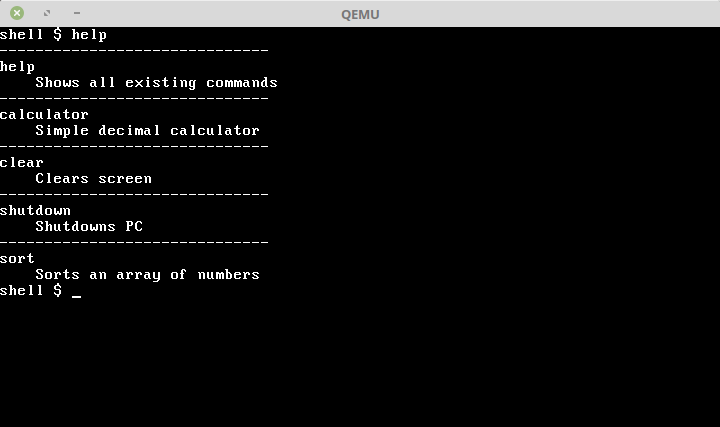

# Screenshot

# About

This is part of laboratory works and it's only for **educational purpose**. Please do not blame me if something is wrong here :D .

# Requirements
0. **bash**
1. **nasm** - the Netwide Assembler, a portable 80x86 assembler
2. **make** - GNU make utility to maintain groups of programs
2. **gcc** - GNU project C and C++ compiler
3. **qemu-system** - emulating system (can be replaced with **VirtualBox**)

To install them, run the following command (**Ubuntu**):

`sudo apt-get install build-essential qemu nasm gcc`

# Commands

`make build` - builds bootloader and kernel
`make clean` - clean project
`make rebuild` - clean project and builds bootloader and kernel
`make run` - builds project and run in **QEMU**

# Bootloader
Bootloader is written in assembly language and it's purpose are: 
- scan for devices, find device where is kernel
- load 30 sectors, which means 15360 bytes and it's enough for our operating system
- switch to 32 bit mode(protected)
- start kernel

# Kernel
Kernel was written in C and it's create from several modules.
## Runtime
Runtime module has several implementations:

1. **Memory** - set of methods for working with memory
2. **Ports** -  set of methods for GPIO
3. **Sorting** - set of algoritms for sorting
4. **String** - set of methods for working with string

## Modules
Modules has several components inside, which works on existing drivers. They are

1. **IO** - io module which uses Keyboard and Display driver. It has methods for getting/putting chart/int onto screen. It also has printf and scanf implemented.
2. **SHELL** - core part of OS, it's shell implementation

## Kernel
It includes everything that's related to Kernel and exactly :

1. Entry point in ASM
2. IDT - Interrupt descriptor table
3. ISR - Interrupt service routine
4. Kernel itself

## Drivers
This OS has several drivers. 
- **ACPI** driver 
- **DISPLAY** driver
- **KEYBOARD** driver
- **TIMER** driver

## Apps
This module has all kernel applications inside. Such as:
- Calculator
- Clearscreen
- Shutdown
- Sort
